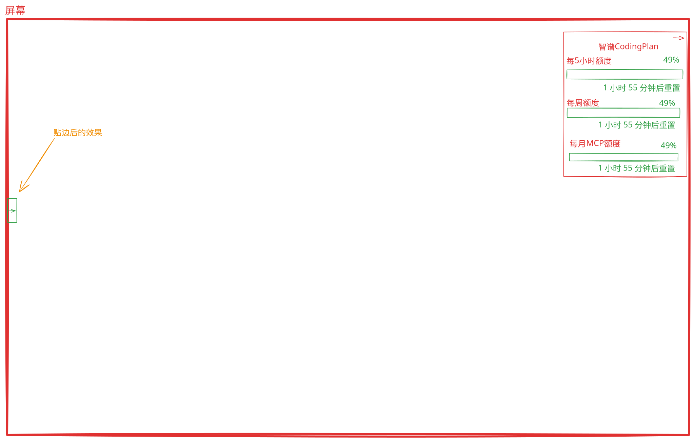

# 目标
实现一个可配置化的CodingPlan额度监视器跨平台的桌面应用。定期获取CodingPlan的额度信息，显示在桌面悬浮面板中。

# 技术选型
- 前端：Tauri 2.0框架
- 后端：Rust
- 配置持久化：JSON文件
- 跨平台：Windows, macOS, Linux（优先适配Windows 11）

# 需求
## UI
该程序的UI包含一个简单的悬浮面板，用于显示CodingPlan的额度信息。以及 一个配置窗口，用于设置监视器的参数。
### 悬浮面板
 - 显示CodingPlan的额度信息。
 - 显示供应商名称
 - 多个供应商的CodingPlan额度信息轮播显示，每个驻留10秒，可在配置界面配置。
 - 额度以进度条+百分比数值显示，根据 配置文件中的阈值，可以设置两段阈值，分别为阈值1和阈值2（默认50%，80%），显示不同的颜色（如小于阈值1绿色、大于等于阈值1且小于阈值2黄色、大于等于阈值2红色）。
 - 当面板锁定开关为关闭时且面板穿透开关为关闭时，用户按住鼠标左键拖动面板，即可移动面板位置。
 - 悬浮面板右上角有最小化按钮，在面板贴边时才可用，点击按钮后收向所贴的屏幕边沿方向收起面板，收缩为紧贴屏幕边沿的状态，并展示一个指向屏幕边沿反方向的小箭头按钮，用户点击该按钮后即可展开面板。
 - 悬浮面板布局参考：

### 配置窗口
- 供应商配置
  - 输入供应商名称
  - 输入供应商的CodingPlan API密钥
  - 配置轮播时间间隔（默认10秒）
  - 配置阈值（默认80%、50%）
  - 限额提醒（默认开启）：用户设置限额提醒阈值，如用户设置80%则在获取到5小时、周、月限量到达80%时弹出对应系统通知。

- 悬浮面板配置
  - 面板背景色： 默认高级黑色（#333333）
  - 面板透明度设置：面板背景色透明度，默认80%。
  - 面板锁定开关：默认关闭，用户可以锁定面板，防止被移动。
  - 面板穿透开关：默认关闭，用户可以穿透面板，查看桌面内容。
  - 额度阈值显示颜色：为小于阈值1、大于等于阈值1且小于阈值2、大于等于阈值2三种额度值的进度条设置不同的颜色（默认绿色、黄色、红色）。

- 配置文件
  - 配置文件路径：`~/.config/coding-plan-monitor/config.json`
  - 配置文件内容：JSON格式，包含供应商配置和轮播时间间隔。


### 系统托盘
 - 系统托盘图标双击可显示/隐藏悬浮面板。
 - 系统托盘图标右键菜单包含：
  - 显示/隐藏悬浮面板
  - 配置窗口
  - 退出应用


## 功能需求
### 多供应商适配
需要支持不同的CodingPlan供应商，使用适配器模式适配不同的供应商。开发时，分析不同供应商的限额查询页面编写获取限额数据的适配代码，如果供应商支持接口查询则直接调用api获取数据（API_key在配置中心让用户录入），否则通过解析页面内容获取对应的api获取数据。如果获取限额时有403等登录失效的错误，程序引导用户进行网页登录然后获取用户的授权头用以调用api。
目前支持的供应商如下：
- 智谱CodingPlan
  - 限额查询页面：https://bigmodel.cn/coding-plan/personal/usage
  - 面板显示的额度信息：每5小时使用额度（进度条、 百分比数值显示、重置时间）、每周使用额度（进度条、 百分比数值显示、重置时间）、MCP 每月额度（进度条、 百分比数值显示、重置时间）、Token 消耗总量（取当天数据，只显示数值，如200.23M）

- MiniMax TokenPlan
  - 限额查询API：
  ```shell
  curl --location 'https://www.minimaxi.com/v1/token_plan/remains' \
--header 'Authorization: Bearer <API Key>' \
--header 'Content-Type: application/json'
  ```
  - 面板显示的额度信息：文本生成5小时使用额度（进度条、 百分比数值显示、重置时间，对应接口返回的model_name为"MiniMax-M*"的数据）、文本生成周使用额度（进度条、 百分比数值显示、重置时间，对应接口返回的model_name为"MiniMax-M*"的数据）、图像生成5小时使用额度（进度条、 百分比数值显示、重置时间，对应接口返回的model_name为"coding-plan-vlm"的数据）、图像生成周使用额度（进度条、 百分比数值显示、重置时间，对应接口返回的model_name为"coding-plan-vlm"的数据）

- 火山CodingPlan
  - 限额查询页面：https://console.volcengine.com/ark/region:ark+cn-beijing/openManagement?LLM=%7B%7D&advancedActiveKey=subscribe
  - 面板显示的额度信息：每5小时使用额度（进度条、 百分比数值显示、重置时间）、每周使用额度（进度条、 百分比数值显示、重置时间）、MCP 每月额度（进度条、 百分比数值显示、重置时间）、Token 消耗总量（取当天数据，只显示数值，如200.23M）
